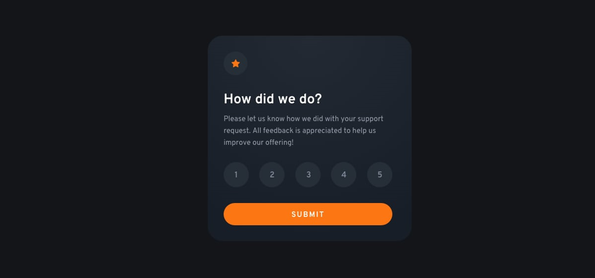

<h1 align="center">Interactive Rating Component</h1>

Este pequeno projeto é um desafio do FrontendMentor, ele consiste em HTML, CSS e JS, usufrui de funções básicas e essenciais do JS, sendo um bom desafio para praticar.

## Índice

- [Visão Geral](#visão-geral)
- [Funcionalidades](#funcionalidades)
- [Demo](#demo)
- [Contato](#contato)

## Visão Geral

Há várias formas e maneiras de se fazer este desafio, dei preferência ao JavaScript, pois assim conseguiria evoluir e pratica-lo mais. 

## Funcionalidades

- Componente interativo de avaliação, muitas empresas e sites tem um sistema como esse;
- O usuário consegue marcar qual foi a sua satisfação com o suporte e dar um feedback;
- Foi designado utilizando principalmente JS tanto na automação como em algumas estilizações, praticamente perfeita em termos de design para o original;

## Demo

[Link para a demonstração do projeto](https://bruno-nog.github.io/interactive-rating-component/)

## Contato

